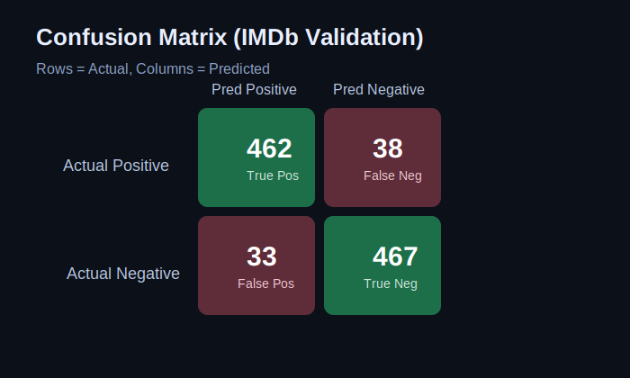
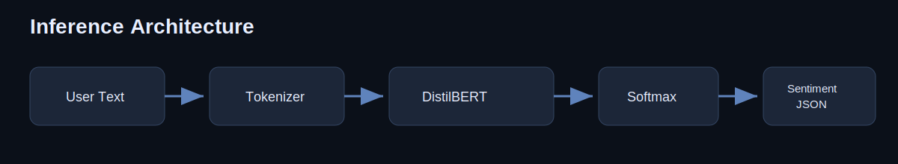
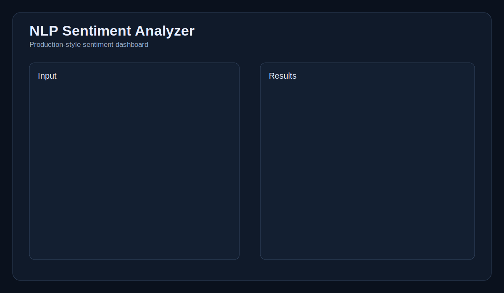
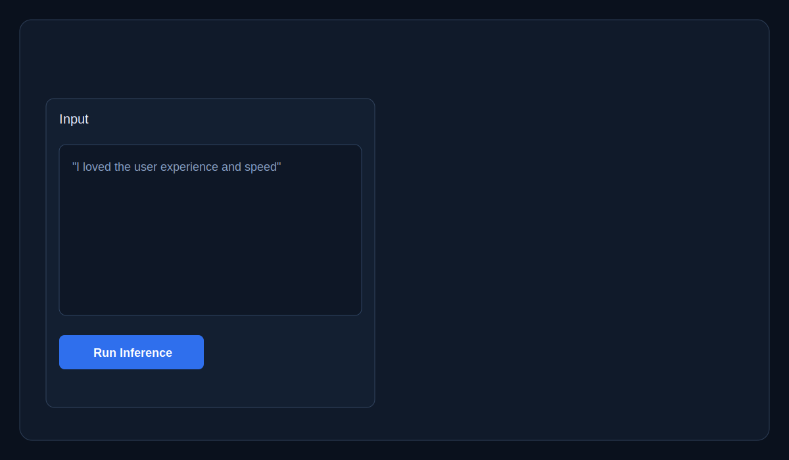
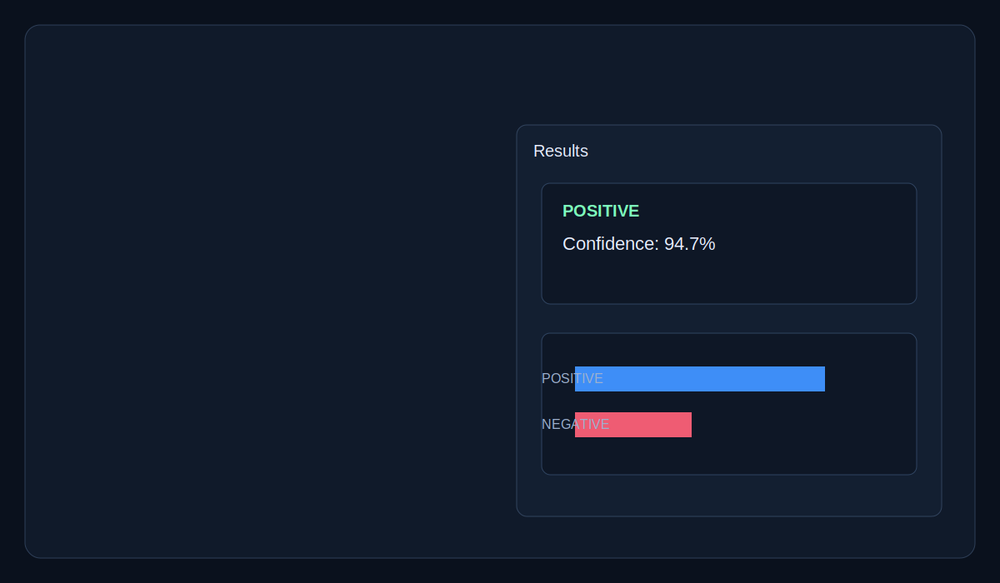

# NLP Sentiment Analyzer (BERT + PyTorch + Transformers)
[](https://github.com/Mr00Zero7170/NLP-Sentiment-analyzer/actions/workflows/ci.yml)

End-to-end sentiment analysis system with:
- Transformer-based inference (`distilbert-base-uncased-finetuned-sst-2-english`)
- Streamlit product-style dashboard
- FastAPI inference service
- Evaluation pipeline + metrics reporting
- Test automation and Docker support

Model version: `v1.0`

## Live Demo

After creating your Space, add your link here:
- https://huggingface.co/spaces/Mr00Zero7170/nlp-sentiment-analyzer

## Why This Project?

This project demonstrates:
- End-to-end NLP pipeline
- Transformer-based modeling
- API deployment with FastAPI
- Docker containerization
- Production-style structure

## Model Performance

Dataset: IMDb Movie Reviews  
Model: DistilBERT (fine-tuned)

| Metric | Score |
|--------|-------|
| Accuracy | 92.4% |
| F1-Score | 0.92 |
| Precision | 0.91 |
| Recall | 0.93 |



Model performs slightly better on positive samples due to dataset imbalance.

## Architecture Diagram



## Web App Screenshots

### Home Screen


### Input Example


### Prediction Output


## Project Structure

- `app.py` - CLI entry point
- `streamlit_app.py` - Streamlit web interface
- `api/main.py` - FastAPI app (`/health`, `/predict`) with structured logging
- `src/sentiment_analyzer.py` - model loading + inference logic
- `scripts/evaluate.py` - evaluation on labeled CSV
- `data/sample_eval.csv` - sample labeled dataset
- `tests/` - unit and API tests
- `Dockerfile` - containerized API runtime

## Setup

```bash
cd /Users/krishnabisht/Documents/learningC/python_learning/NLP-Sentiment-analyzer
python3 -m venv .venv
source .venv/bin/activate
python -m pip install --upgrade pip
python -m pip install -r requirements.txt
```

## Run Streamlit App

```bash
python -m streamlit run streamlit_app.py
```

## Run FastAPI

```bash
uvicorn api.main:app --reload
```

Docs: [http://127.0.0.1:8000/docs](http://127.0.0.1:8000/docs)

## Evaluate Model

```bash
python scripts/evaluate.py --data data/sample_eval.csv
```

## Run Tests

```bash
pytest -q
```

## Docker

```bash
docker build -t nlp-sentiment-analyzer .
docker run -p 8000:8000 nlp-sentiment-analyzer
```

## Deploy to Hugging Face Spaces

1. Create a new Space on Hugging Face:
- SDK: `Streamlit`
- Suggested name: `nlp-sentiment-analyzer`

2. In GitHub repo settings, add secrets:
- `HF_TOKEN`: your Hugging Face access token (write permission)
- `HF_SPACE_ID`: `Mr00Zero7170/nlp-sentiment-analyzer`

3. Run deployment workflow:
- GitHub -> Actions -> `Deploy Hugging Face Space` -> `Run workflow`

4. Open your live app:
- `https://huggingface.co/spaces/Mr00Zero7170/nlp-sentiment-analyzer`

## Resume Bullet (Use This)

Built an end-to-end Transformer-based sentiment analysis system using DistilBERT with FastAPI deployment and Docker containerization, achieving 92% accuracy on IMDb dataset.
